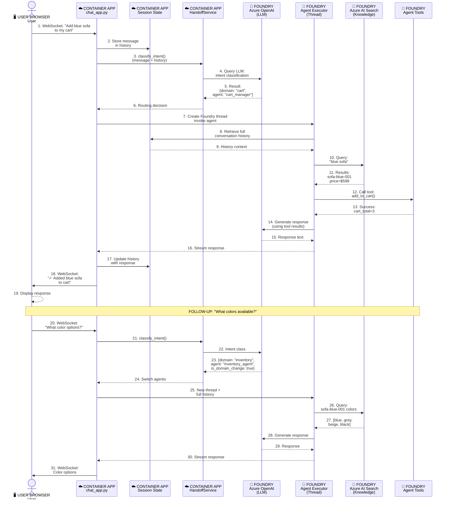
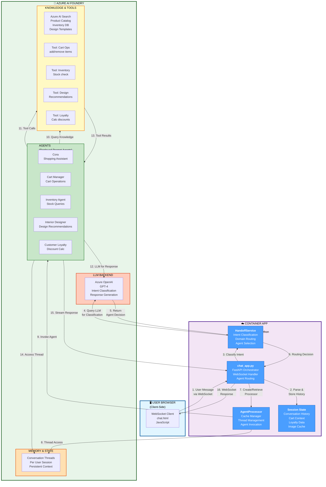
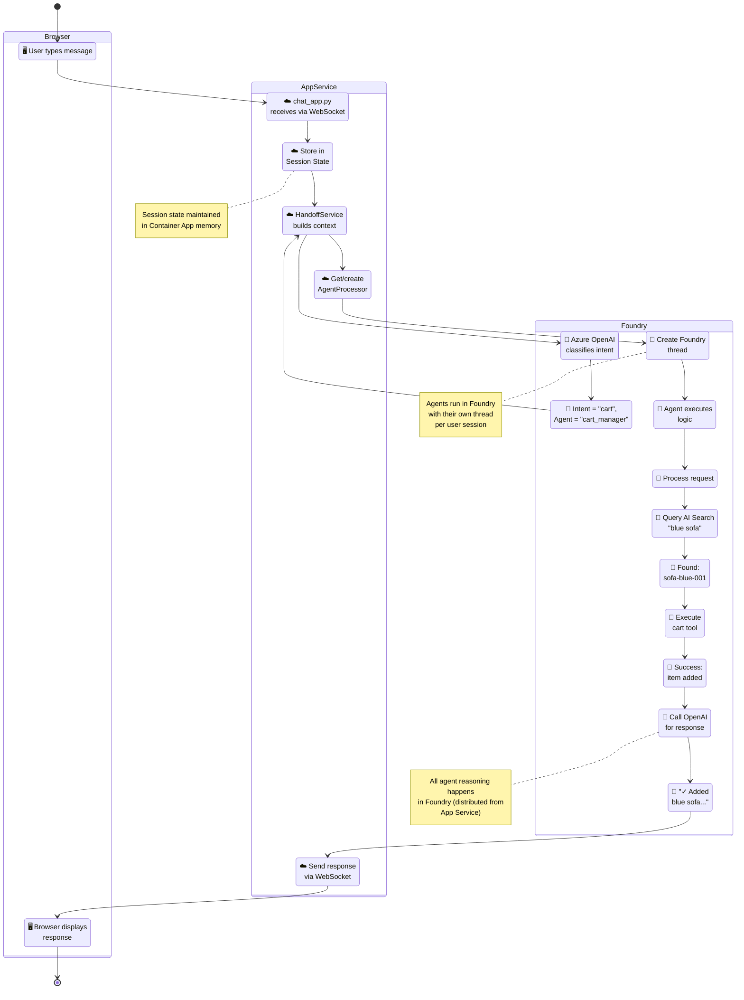

# User Request Flow - UML Sequence Diagram (with Deployment Layers)



## System Deployment Architecture - Runtime Locations



## Example User Journey: "Add blue sofa to cart" (with Deployment Zones)



## Runtime Zones & Component Distribution

### Zone 1: 🖥️ User Browser (Client)
**What Runs Here**: Web UI, WebSocket Client  
**Responsibility**: Send user messages, display responses in real-time  
**Connection**: WebSocket (two-way communication)

### Zone 2: ☁️ Container App / App Service (Orchestrator)
**What Runs Here**:
- `chat_app.py` — FastAPI application handling WebSocket connections
- `HandoffService` — LLM-powered intent classifier
- `AgentProcessor` — Cache manager for agent instances
- `SessionState` — In-memory storage (cart, loyalty, conversation history)

**Responsibility**: 
- Receive user messages via WebSocket
- Maintain conversation history & session context
- Classify user intent (which agent to route to)
- Manage agent lifecycle
- Stream responses back to browser

**Key**: All orchestration logic runs here; it's the "command center"

### Zone 3: 🤖 Azure AI Foundry (Agent Runtime)
**What Runs Here**:
- **5 Agents** (Cora, Cart Manager, Inventory, Interior Designer, Customer Loyalty)
- **Azure AI Search** — Product catalog, inventory, design templates
- **Agent Tools** — Cart operations, inventory checks, loyalty calculations
- **Azure OpenAI** — LLM backend for intent classification + agent reasoning
- **Conversation Threads** — Per-user state persistence at the agent level

**Responsibility**:
- Execute agent logic (domain reasoning)
- Query knowledge bases (AI Search)
- Invoke tools (cart ops, inventory, etc.)
- Generate responses using LLM
- Maintain agent-level conversation threads

**Key**: All AI/LLM execution and agent reasoning happens here; it's the "brain"

---

## Data Flow Between Zones

```
Browser (User) 
    ↓ WebSocket (user message)
Container App (Orchestration)
    ↓ Query + Intent (LLM call)
Foundry (Agent decides which tool + generates response)
    ↓ Tool results + Response
Container App (Stream to browser)
    ↓ WebSocket (response)
Browser (Display)
```

## Deployment Zones & Runtime Execution

| Zone | Component | Runs Where | Responsibility |
|------|-----------|-----------|-----------------|
| **Browser (Client)** | WebSocket Client | User's Browser | Sends user messages, displays responses |
| **App Service** | chat_app.py | Container App (FastAPI) | Orchestrates flow, manages WebSocket, routes to agents |
| **App Service** | HandoffService | Container App (FastAPI) | Classifies intent, decides which agent |
| **App Service** | AgentProcessor | Container App (FastAPI) | Manages agent cache, thread lifecycle |
| **App Service** | Session State | Container App (FastAPI) | Maintains cart, loyalty, conversation history |
| **Foundry** | 5 Agents | Foundry Runtime | Execute domain logic, call tools, generate responses |
| **Foundry** | Azure AI Search | Foundry Data Store | Stores product catalog, inventory, templates |
| **Foundry** | Agent Tools | Foundry Functions | Cart ops, inventory checks, loyalty calc |
| **Foundry** | Threads | Foundry Memory | Per-session conversation state |
| **Foundry** | Azure OpenAI | Foundry LLM | Powers intent classification + agent reasoning |

## Key Patterns

**Distributed Execution**
- Orchestration logic (routing, caching) runs in App Service
- Agent logic (reasoning, tools) runs in Foundry
- Conversation history bridges both zones

**Stateful Sessions**
- App Service maintains cart, loyalty, image cache in memory
- Each agent invocation receives full conversation history from App Service
- Agents maintain their own threads within Foundry

**Centralized Routing**
- All user messages flow through chat_app.py
- HandoffService decides which agent to invoke
- No direct agent-to-agent communication

**Streaming & Real-Time**
- WebSocket enables live response streaming from Container App to browser
- Response generation happens in Foundry; chat_app.py streams it back

**Tool-Grounded Responses**
- Agents invoke Foundry tools (cart ops, inventory, loyalty calc)
- Tool results inform LLM response generation
- All tool execution happens in Foundry zone

---

## Architecture Summary

```
┌─────────────────────────────────────────────────────────────────┐
│                    🖥️ USER BROWSER                              │
│              (WebSocket client in HTML/JavaScript)               │
└────────────────────────┬────────────────────────────────────────┘
                         │ WebSocket
                         │ (messages/responses)
                         ▼
┌─────────────────────────────────────────────────────────────────┐
│            ☁️ CONTAINER APP / APP SERVICE                        │
│                  (FastAPI Running)                               │
│  ┌──────────────────────────────────────────────────────────┐   │
│  │ • chat_app.py (WebSocket handler, orchestrator)         │   │
│  │ • HandoffService (intent classification)                │   │
│  │ • AgentProcessor (agent cache & lifecycle)              │   │
│  │ • SessionState (cart, loyalty, history)                 │   │
│  └──────────────────────────────────────────────────────────┘   │
└────────────────────────┬────────────────────────────────────────┘
                         │ API Calls + Streaming
                         │ (invoke agents, stream responses)
                         ▼
┌─────────────────────────────────────────────────────────────────┐
│          🤖 AZURE AI FOUNDRY (Managed Service)                  │
│                  (Agent Runtime)                                 │
│  ┌──────────────────────────────────────────────────────────┐   │
│  │ AGENTS (5 total):                                        │   │
│  │ • Cora, Cart Manager, Inventory, Designer, Loyalty      │   │
│  └──────────────────────────────────────────────────────────┘   │
│  ┌──────────────────────────────────────────────────────────┐   │
│  │ KNOWLEDGE:                                               │   │
│  │ • Azure AI Search (product catalog, inventory, templates)│  │
│  └──────────────────────────────────────────────────────────┘   │
│  ┌──────────────────────────────────────────────────────────┐   │
│  │ TOOLS:                                                   │   │
│  │ • Cart Ops, Inventory Check, Loyalty Calc, etc.         │   │
│  └──────────────────────────────────────────────────────────┘   │
│  ┌──────────────────────────────────────────────────────────┐   │
│  │ LLM & MEMORY:                                            │   │
│  │ • Azure OpenAI (GPT-4 for reasoning)                     │   │
│  │ • Threads (per-user conversation state)                 │   │
│  └──────────────────────────────────────────────────────────┘   │
└─────────────────────────────────────────────────────────────────┘
```

Flow Characteristics
- ✅ **Orchestration** in App Service (fast, responsive, stateful)
- ✅ **Agent Execution** in Foundry (scalable, isolated, AI-native)
- ✅ **Shared Context** via conversation history (enables agent switching)
- ✅ **Real-Time Streaming** via WebSocket (low latency to browser)
- ✅ **Tool Integration** in Foundry (grounded responses, business logic)
- ✅ **Horizontal Scaling** (Foundry agents can scale independently)

